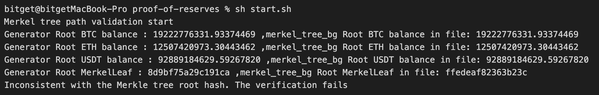

92bba2eeb8715af875c4c66db32a88419ee6bc34# Proof of Reserves Licensed to Bitget Limited
## Background

Bitget launches Proof of Reserve (PoR) to improve the security and transparency of user assets. These tools will allow you to independently audit Bitget’s Proof of Reserves as well as verify that Bitget’s reserves have exceed the exchange’s known liabilities to all users to confirm Bitget’s solvency.

## Introduction
### Build from source
Download the latest version for your operating system and architecture. Also, you can build the source code yourself.

[Download] (https://www.oracle.com/java/technologies/downloads/)Install JDK(Java Development Kit)  
[Download] (https://maven.apache.org/download.cgi.)Install Maven build tool

The minimum prerequisite to build this project requires Java version >= 11, Maven version >= 3.8.4

### Package and compile source code
#### Enter the path for the project
`cd ~/Downloads/proof-of-reserves`

#### Install dependencies
`mvn clean install`

#### Start up
`java -jar proof-of-reserves.jar`

# Technical Description
## What is the Merkle Tree?
Merkle Tree is a data structure, also known as a Hash Tree. Merkle tree stores data in the leaf nodes of the tree structure, and by hashing the data step by step up to the top root node, any changes in the data of the leaf nodes will be passed to the higher level nodes and eventually displayed as changes in the root of the tree.

### 1. The roles of Merkle tree
- Zero-knowledge proof
- Ensure data immutability
- Ensures data privacy
### 2. Bitget Limited Merkle Tree Definition
#### 2.1 Node Information
Information stored in every tree node includes:
1. hash value;
2. the number of coins contained in the user's asset snapshot (BTC, ETH, USDT for example);
```
   hash value,{"BTC":"BTC amount","ETH":"ETH amount","USDT":"USDT amount"}
   2070b6a5b12f4ea7,{"BTC":1.763,"ETH":362,"USDT":1077200.2274}
```
#### 2.2 Hash Rules
##### Leaf nodes (except padding nodes)
`hash=sha256Function(encryptUid,nonce,balances).substring(0,16)`
- encryptUid: encrypted UID of the user
- nonce: a unique value assigned to each user
- balances: json string composed of the number of coins in the user's asset snapshot, (note: remove the invalid 0 at the end and keep precision of 8 bits)
    - For example：
  ```json
  {"BTC":1.763,"ETH":362,"USDT":1077200.2274}
   ```  
  ##### Parent node
  ```
  Parent node's hash = sha256Function(hash1+hash2,{"BTC":(hash1(BTC amount)+hash2(BTC amount)),"ETH":(hash1(ETH amount)+hash2(ETH amount)),"USDT":(hash1(USDT amount)+hash2(USDT amount))},parent node level).substring(0,16)
   ```
- h1: hash of the left child node of the current node,
- h2: hash of the right child node of the current node,
- level: where the parent node lies in

**Definition of tree node level**：A complete Merkle Tree (full binary tree) requires 2^n leaf node data, leaf node level = n + 1, parent node level = child node level - 1, root node level = 1, leaf node level is the maximum

##### Padding node rules
A complete Merkle Tree (full binary tree) requires 2^n leaf node data, but the actual number of data may not satisfy and may be odd. In such a case, if a node k has no sibling node, then auto padding generates a sibling node k', and`hash(k')=hash(k)`, and the number of coins of node k' is set to zero.


###### For example：
| Hash   | balances  |
|--------| -------------|
| hash1  | {"BTC":1,"ETH": 6,"USDT":10}|
| hash2  | {"BTC":2,"ETH":4,"USDT":8}|
| hash3  | {"BTC":5,"ETH":9,"USDT":74}|

Then the padding node hash4 = hash3, stored balances are `{"BTC": 0, "ETH": 0,"USDT": 0}`，as shown in the highlighted node in Figure one：
Figure one


```
Parent node's hash = sha256Function(hash1+hash2,{"BTC":(hash1(BTC amount)+hash2(BTC amount)),"ETH":(hash1(ETH amount)+hash2(ETH amount)),"USDT":(hash1(USDT amount)+hash2(USDT amount))},parent node level).substring(0,16)
```  
Thus：
`hash6 = SHA256(hash3 + hash3, {BTC: (2+0), ETH:(1+0), USDT:(12+0)}, level)`

### Verification Principle
#### 1、Verification principle:
According to the definition of Bitget Limited Merkle tree, the hash value of the parent node is calculated from the user's own leaf node up to the root node, and the hash value of the root node is compared with the hash value of the Merkle tree in "Verification Step - Step 1", if the two are equal, the verification passes, if not, the verification fails.

#### 2、Example：
Combining figure one and the following json text, and based on the user's own leaf node h3 and the information provided by the adjacent node h4, we can calculate out the hash of the parent node h6, and then with the information provided by the adjacent node h5, we can calculate out the hash of the parent node h7, and then compare the hash value with the root node h7 provided in the Merkle tree path data to see if the hash values are equal to complete the validation.
Merkle tree path data json text:
```json
{
   "path": [
      {
         "auditId": "Au20221125",
         "balances": {
            "BTC": 4.6115136,
            "ETH": 0,
            "USDT": 4372722.80025793
         },
         "encryptUid": "58b8f244a465335eb0c67e0d5c13a66b52c76abc1e41a6373763da35f5ce7ce1",
         "level": 3,
         "merkelLeaf": "8cf0243a2c76fe0b",
         "nonce": "gblzjurybs7fiptqdaez6t3pegazguye77fhsr6q4tbqkndubnjf1962csg54em4",
         "role": 2
      },
      {
         "auditId": "Au20221125",
         "balances": {
            "BTC": 0.000098,
            "ETH": 0,
            "USDT": 9000.30237189
         },
         "level": 2,
         "merkelLeaf": "8306844dff98ba79",
         "role": 2
      },
      {
         "auditId": "Au20221125",
         "balances": {
            "BTC": 2001254.40269617,
            "ETH": 1999998.0656526,
            "USDT": 993781612.22955519
         },
         "level": 1,
         "merkelLeaf": "94d0d60f7cdce5fe",
         "role": 3
      }
   ],
   "self": {
      "auditId": "Au20221125",
      "balances": {
         "BTC": 2001249.79108457,
         "ETH": 1999998.0656526,
         "USDT": 989399889.12692537
      },
      "encryptUid": "8c3358cd4d2572cf01de53f41717e72a91b4c6da53ce1232113c91e5cf192dd4",
      "level": 3,
      "merkelLeaf": "cb575fb1eb6462f9",
      "nonce": "fi9honco6fww8afc4t2se8aml3i46pzfwjgepy3n2bbvuouns4tfiasz60klcm1p",
      "role": 1
   }
}
```

#### Verification Steps
1. Take the executable verifier that you need to download on the Bitget platform for your operating system and architecture.
- proof-of-reserves-linux-amd64-v1.0.2.zip
- proof-of-reserves-linux-arm64-v1.0.2.zip
- proof-of-reserves-macos-v1.0.2.zip
- proof-of-reserves-windows-v1.0.2.zip
2. Unzip the file to a specified directory, for example:
   `~/Downloads/proof-of-reserves-*`
3. Download the file merkel_tree_bg.json and substitute the file with the same name under your directory`~/Downloads/proof-of-reserves-*`
4. Run start file `sh start.sh` or Click the `start.bat` file
5. View results  
   1）If your data are correct and the verification passed, then the result is "Consistent with the Merkle tree root hash. The verification succeeds".
     
   2）If your data are wrong and the verification fails, the result is "Inconsistent with the Merkle tree root hash. The verification fails".
   
6. You can also refer to the Bitget Limited open source verification tool code and Merkle tree definition (refer to the "What is the Merkle Tree" section) and write your own program to verify the path data obtained in step 2, or check to make sure your assets are included in the Merkel tree generated by this audit.