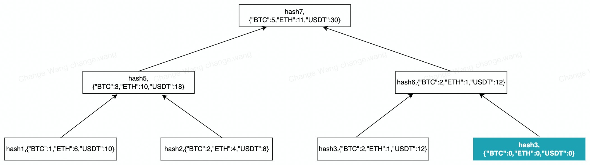

# Bitget Limited 储备证明
## 背景
Bitget推出储备证明（PoR）以提高用户资产的安全性和透明度。这些工具将允许您独立审计 Bitget 的准备金证明，并验证 Bitget 的准备金是否超过交易所对用户的已知负债，以确认 Bitget 的偿付能力。

## 介绍
### 源码构建
下载适用于您的操作系统和体系结构的最新版本。此外，您可以自己构建源代码。

[下载](https://www.oracle.com/java/technologies/downloads/)安装JDK(Java Development Kit)  
[下载](https://maven.apache.org/download.cgi?.)安装Maven编译工具

构建此开源代码需要 Java（版本 >= 11）, Maven（版本 >= 3.8.4）  

### 打包编译源代码
#### 进入项目目录
`cd ~/Downloads/proof-of-reserves`

#### 安装依赖
`mvn clean install`

#### 启动
`java -jar proof-of-reserves.jar`

# 技术细节
## 什么是默克尔树？
默克尔树（Merkle Tree ）是一种数据结构，又叫哈希树（Hash Tree）。默克尔树将数据存储在树状结构的叶子节点中，并通过对数据的逐级哈希（Hash）直到顶部根节点，叶子节点数据的任何变动，都会传递到上一级节点并最终反应到树根的变化。

### 1. 默克尔树的作用  
- 零知识证明
- 确保数据的不可篡改性
- 确保数据的隐私性
### 2. Bitget Limited  默克尔树定义  
   #### 2.1 节点信息
   每个树节点存储信息包括:  
   1. hash值; 2. 用户资产快照包含的币种数量（以BTC, ETH, USDT为例）
```
   hash值,{"BTC":"BTC数量","ETH":"ETH数量","USDT":"USDT数量"}
   2070b6a5b12f4ea7,{"BTC":1.763,"ETH":362,"USDT":1077200.2274}
```
   #### 2.2 Hash规则
   ##### 叶子结点（填充节点除外）
   `hash=sha256Function(encryptUid,nonce,balances).substring(0,16)`
- encryptUid: 用户的加密uid
- nonce: 每个用户分配一个唯一值
- balances: 用户资产快照币种数量组成的json字符串，（注意：去除末尾无效0，保留8位精度）
    - 如：
  ```json
  {"BTC":1.763,"ETH":362,"USDT":1077200.2274}
   ```  
  ##### 父节点
  ```
  父节点的hash = sha256Function(hash1+hash2,{"BTC":(hash1(BTC数量)+hash2(BTC数量)),"ETH":(hash1(ETH数量)+hash2(ETH数量)),"USDT":(hash1(USDT数量)+hash2(USDT数量))},父节点level).substring(0,16)
   ```
- h1: 当前节点的左子节点的hash，
- h2: 当前节点的右子节点的hash，
- level: 父节点的层级   

**树节点的层级定义**：构建一棵完整的Merkle Tree（满二叉树）需要2^n个叶子结点数据，叶子结点层级=n+1，父节点层级=子节点层级-1，根节点层级=1，叶子结点层级最大

##### 填充节点规则
构建一棵完整的Merkle Tree（满二叉树）需要2^n个叶子结点数据，但实际情况数据的数量未必满足且还可能是奇数。在此种情况下，如果一个节点k没有兄弟节点，则自动填充（auto padding）生成一个兄弟节点k'，该节点`hash(k')=hash(k)`，节点k'的币种数量全置零。


###### 例子：
| Hash   | balances  |
|--------| -------------|
| hash1  | {"BTC":1,"ETH": 6,"USDT":10}|
| hash2  | {"BTC":2,"ETH":4,"USDT":8}|
| hash3  | {"BTC":5,"ETH":9,"USDT":74}|

则填充节点hash4=hash3，存储的blances为`{"BTC": 0, "ETH": 0,"USDT": 0}`，如图一高亮节点所示：  
图一


```
父节点的hash = sha256Function(hash1+hash2,{"BTC":(hash1(BTC数量)+hash2(BTC数量)),"ETH":(hash1(ETH数量)+hash2(ETH数量)),"USDT":(hash1(USDT数量)+hash2(USDT数量))},父节点level).substring(0,16)
```  
故：
`hash6 = SHA256(hash3 + hash3, {BTC: (2+0), ETH:(1+0), USDT:(12+0)}, level)`

### 验证原理
#### 1、验证原理：
根据Bitget Limited 默克尔树定义，从用户本身叶子结点开始往上计算父节点hash值，一直到根节点得出hash(root)，对比“验证步骤-步骤1”中的默克尔树根节点的hash值，如果二者相等则验证通过，不等则验证不通过

#### 2、例子：
结合图一和下面的json文本，依据用户本身叶子节点h3和提供的相邻节点h4信息可以计算出父节点h6的hash，再和提供的相邻节点h5信息可以计算出父节点h7的hash，然后和默克尔树路径数据中提供的根节点h7信息对比hash值是否相等即可完成验证。
默克尔树路径数据json文本：
```json
{
   "path": [
      {
         "auditId": "Au20221125",
         "balances": {
            "BTC": 4.6115136,
            "ETH": 0,
            "USDT": 4372722.80025793
         },
         "encryptUid": "58b8f244a465335eb0c67e0d5c13a66b52c76abc1e41a6373763da35f5ce7ce1",
         "level": 3,
         "merkelLeaf": "8cf0243a2c76fe0b",
         "nonce": "gblzjurybs7fiptqdaez6t3pegazguye77fhsr6q4tbqkndubnjf1962csg54em4",
         "role": 2
      },
      {
         "auditId": "Au20221125",
         "balances": {
            "BTC": 0.000098,
            "ETH": 0,
            "USDT": 9000.30237189
         },
         "level": 2,
         "merkelLeaf": "8306844dff98ba79",
         "role": 2
      },
      {
         "auditId": "Au20221125",
         "balances": {
            "BTC": 2001254.40269617,
            "ETH": 1999998.0656526,
            "USDT": 993781612.22955519
         },
         "level": 1,
         "merkelLeaf": "94d0d60f7cdce5fe",
         "role": 3
      }
   ],
   "self": {
      "auditId": "Au20221125",
      "balances": {
         "BTC": 2001249.79108457,
         "ETH": 1999998.0656526,
         "USDT": 989399889.12692537
      },
      "encryptUid": "8c3358cd4d2572cf01de53f41717e72a91b4c6da53ce1232113c91e5cf192dd4",
      "level": 3,
      "merkelLeaf": "cb575fb1eb6462f9",
      "nonce": "fi9honco6fww8afc4t2se8aml3i46pzfwjgepy3n2bbvuouns4tfiasz60klcm1p",
      "role": 1
   }
}
```

#### 验证步骤
1. 将您在Bitget平台下载的适用于您的操作系统和体系结构的可执行验证程序
- proof-of-reserves-linux-amd64-v1.0.2.zip
- proof-of-reserves-linux-arm64-v1.0.2.zip
- proof-of-reserves-macos-v1.0.2.zip
- proof-of-reserves-windows-v1.0.2.zip
2. 解压文件到指定目录，例如 
`~/Downloads/proof-of-reserves-*`
3. 将Bitget平台下载的 merkel_tree_bg.json 文件替换 `~/Downloads/proof-of-reserves-*` 目录下的同名文件
4. 运行start文件 `sh start.sh` 或者 点击运行 `start.bat`  
5. 查看结果  
   1）如果您的数据正确，验证通过则执行结果为 “Consistent with the Merkle tree root hash. The verification succeeds”。  
     
   2）如果您的数据错误，验证失败则执行结果为 “Inconsistent with the Merkle tree root hash. The verification fails”。  
     
6. 您也可以参考 Bitget Limited 开源验证工具代码和默克尔树定义（参考“什么是默克尔树”章节），自行写程序验证步骤2获取到的路径数据，或者查看确认自己的资产被包含在此次审计生成的默克尔树中。